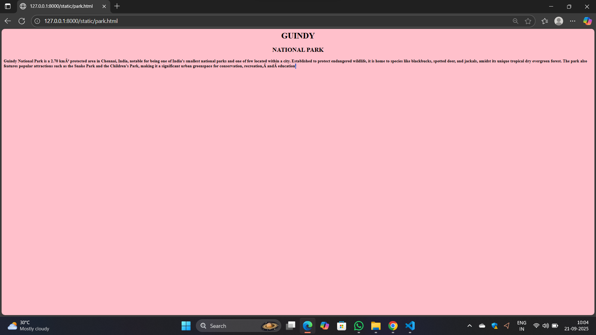

# Ex04 Places Around Me
## Date: 21-09-2025

## AIM
To develop a website to display details about the places around my house.

## DESIGN STEPS

### STEP 1
Create a Django admin interface.

### STEP 2
Download your city map from Google.

### STEP 3
Using ```<map>``` tag name the map.

### STEP 4
Create clickable regions in the image using ```<area>``` tag.

### STEP 5
Write HTML programs for all the regions identified.

### STEP 6
Execute the programs and publish them.

## CODE
```
map.html

<html>
    <head>

    </head>
    <body>
        

<map name="image-map">
    <area target="" alt="annaunivercity" title="annaunivercity" href="univercity.html" coords="1606,201,1754,280" shape="rect">
    <area target="" alt="guindy" title="guindy" href="guindy.html" coords="1036,423,64" shape="circle">
    <area target="" alt="cricket" title="cricket" href="cricket.html" coords="271,397,317,392,313,355,301,306,153,300,113,397,143,414,149,422,168,396,194,414,232,399,143,414" shape="poly">
    <area target="" alt="nationalpark" title="nationalpark" href="park.html" coords="1321,477,1464,593" shape="rect">
    <area target="" alt="kannigapuram" title="kannigapuram" href="kannigapuram.html" coords="856,629,1038,681" shape="rect">
</map>
    </body>
</html>

cricket.html
<html>
    <head>

    </head>
    <body bgcolor="red">
        <h1 align="center">GUINDY</h1>
        <h2 align="center">CRICKET ACADEMY</h2>
        <h4>Cricket is a popular bat-and-ball sport played by two teams of eleven players on a large, grassy field, with a focus on batting, bowling, and fielding to score runs and get opponents out. Originating in England, the game is now played worldwide, especially in countries like India, Australia, and South Africa. The game involves a central rectangular pitch with wooden wickets at each end. Players try to hit a bowled ball to score runs by running between the wickets, while the fielding team attempts to dismiss the batsmen. Matches can range from a few hours to several days in length, with different formats including Test matches and faster-paced limited-overs games.</h4>
    </body>
</html>

guindy.html

<html>
    <head>

    </head>
    <body bgcolor="green">
        <h1 align="center">GUINDY</h1>
        <h2 align="center">GUINDY-CITY</h2>
        <h4>Guindy is a neighborhood of Chennai, Tamil Nadu. The Kathipara junction where Anna Salai, Mount-Poonamallee Road, Inner Ring Road, 100 Feet Road or Jawaharlal Nehru Road, and GST Road meet here. It is one of the important nodal points of road traffic in the metropolitan area. It is also a commercial hub. Here is headquarters of Ashok Leyland This junction serves as the entry point to the city limits from the suburbs. It is surrounded by Saidapet in the North, Kotturpuram and Adyar towards the East, Velachery in the South, Adambakkam and Alandur in the South-West, Parangimalai in the West and Ekkatutthangal in the North-West. Guindy is home to many important landmarks in the city, the most famous amongst them being the Guindy National Park. It also serves as a main hub for several small and medium scale industries (Guindy Thiru Vi Ka Estate). Transportation to/from the neighborhood is catered by Guindy railway station and Guindy metro station.
</h4>
    </body>
</html>

kannigapuram.html
<html>
    <head>

    </head>
    <body bgcolor="grey">
        <h1 align="center">GUINDY</h1>
        <h2 align="center">KANNIGAPURAM</h2>
        <h4>Kannigapuram, Little Mount, Guindy is a Locality in St.thomas Mount City in Tamil Nadu State, India.
Kannigapuram, Little Mount, Guindy Pin code is 600042 and postal head office is Velacheri .

Kannikapuram , Kanniga Puray , Guindy National Park , Raj Bhavan Colony , Narasinga Colony are the nearby Localities to Kannigapuram Little Mount Guindy.

Chennai , Ambattur , Nandivaram-Guduvancheri , Thirunindravur are the nearby Cities to St.thomas Mount.

It is near to bay of bengal. There is a chance of humidity in the weather.</h4>
    </body>
</html>

park.html

<html>
    <head>

    </head>
    <body bgcolor="pink">
        <h1 align="center">GUINDY</h1>
        <h2 align="center">NATIONAL PARK</h2>
        <h4>Guindy National Park is a 2.70 km² protected area in Chennai, India, notable for being one of India's smallest national parks and one of few located within a city. Established to protect endangered wildlife, it is home to species like blackbucks, spotted deer, and jackals, amidst its unique tropical dry evergreen forest. The park also features popular attractions such as the Snake Park and the Children's Park, making it a significant urban greenspace for conservation, recreation, and education.</h4>
    </body>
</html>

univercity.html
<html>
    <head>

    </head>
    <body bgcolor="skyblue">
        <h1 align="center">GUINDY</h1>
        <h2 align="center">ANNA UNIVERCITY</h2>
        <h4>Anna University is a public state university established in Chennai, India, on September 4, 1978, offering higher education in engineering, technology, architecture, and applied sciences. Named after former Tamil Nadu Chief Minister C.N. Annadurai, it promotes research and knowledge dissemination and is recognized for its strong industry collaborations, competitive B. Tech and M. Tech programs, and quality research output. It is a member of organizations like the Association of Indian Universities and is ranked globally in various fields.</h4>
    </body>
</html>

```


## OUTPUT




## RESULT
The program for implementing image maps using HTML is executed successfully.
